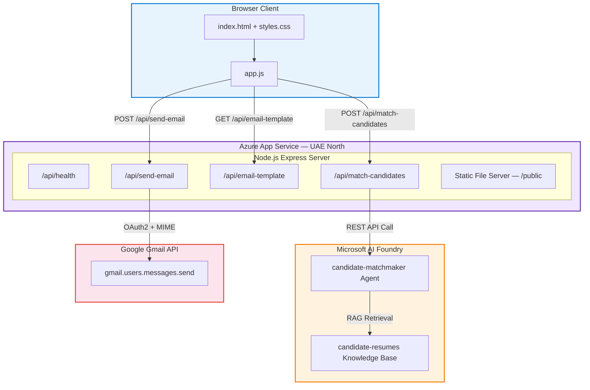

<div align="center">

# HiringBazzar — AI-Powered Candidate Matchmaker

### Intelligent Recruitment Powered by Microsoft AI Foundry & Gmail API

[](https://hiringbazzar.azurewebsites.net)
[](https://nodejs.org/)
[](https://azure.microsoft.com/)
[](https://ai.azure.com/)
[](https://developers.google.com/gmail/api)

---

**HiringBazzar** is an AI-powered recruitment assistant that matches job descriptions against a candidate resume knowledge base using **Microsoft AI Foundry Agents**, then enables recruiters to send personalized interview outreach emails directly via the **Gmail API** — all from a single, clean web interface.

**Live Application:** [https://hiringbazzar.azurewebsites.net](https://hiringbazzar.azurewebsites.net)

</div>

---

# Key Features

| Feature | Description |
|---|---|
| **AI-Powered Matching** | Leverages a Microsoft AI Foundry Agent grounded in a `candidate-resumes` knowledge base to intelligently rank candidates against any job description |
| **Match Scoring** | Each candidate receives a 0–100 match score with a detailed 5-line profile summary |
| **One-Click Email Outreach** | Auto-generates professional interview invitation emails and sends them via Gmail API with OAuth2 |
| **Enterprise UI** | Clean, responsive single-page interface built with vanilla HTML/CSS/JS — zero build tools, instant load |
| **Azure Hosted** | Production-deployed on Azure App Service (UAE North) with environment-based configuration |
| **Keyboard Shortcuts** | `Ctrl + Enter` to instantly submit a job description |

---

# System Architecture



---

# Application Workflow

## End-to-End Recruitment Flow

```mermaid
flowchart LR
    A["Recruiter enters<br/>Job Description"] --> B["Express API receives<br/>POST request"]
    B --> C["AI Foundry Agent<br/>analyzes JD against<br/>resume knowledge base"]
    C --> D["Agent returns ranked<br/>candidates with scores<br/>& email addresses"]
    D --> E["UI renders<br/>candidate cards<br/>with match scores"]
    E --> F["Recruiter clicks<br/>Send Outreach"]
    F --> G["Auto-generated<br/>interview email<br/>via Gmail API"]
    G --> H["Candidate receives<br/>professional interview<br/>invitation"]

    style A fill:#DBEAFE,stroke:#2563EB,stroke-width:2px
    style C fill:#FEF3C7,stroke:#F59E0B,stroke-width:2px
    style E fill:#D1FAE5,stroke:#10B981,stroke-width:2px
    style G fill:#FCE7F3,stroke:#EC4899,stroke-width:2px
    style H fill:#D1FAE5,stroke:#10B981,stroke-width:2px
```



---

# Project Structure

```
HiringBazzar/
├── .env                    # Environment variables (git-ignored)
├── .gitignore              # Git ignore rules
├── package.json            # Node.js dependencies & scripts
├── server.js               # Express server — API routes & static hosting
├── foundryService.js       # AI Foundry SDK — agent invocation & response parsing
├── emailService.js         # Gmail API — OAuth2 auth, email drafting & sending
├── public/                 # Frontend (served statically by Express)
│   ├── index.html          # Single-page semantic HTML layout
│   ├── styles.css          # Professional enterprise styling
│   └── app.js              # Client-side logic — API calls, UI rendering, modals
└── README.md               # This file
```

---

# Quick Start (Local Development)

## Prerequisites

- **Node.js 20 LTS** or later
- **Azure AI Foundry** project with a `candidate-matchmaker` agent
- **(Optional)** Gmail OAuth2 credentials for email outreach

## 1. Clone the Repository

```bash
git clone https://github.com/your-username/Recruiter_AI_agent.git
cd Recruiter_AI_agent
```

## 2. Install Dependencies

```bash
npm install
```

## 3. Configure Environment Variables

Create a `.env` file in the project root:

```env
PORT=3000

# ── Microsoft AI Foundry ──────────────────────────────
FOUNDRY_PROJECT_ENDPOINT=https://<your-resource>.services.ai.azure.com/api/projects/<your-project>
FOUNDRY_AGENT_NAME=candidate-matchmaker
FOUNDRY_API_KEY=your-foundry-api-key

# ── Azure OpenAI (used by Foundry) ────────────────────
AZURE_OPENAI_API_DEPLOYMENT_NAME=gpt-4.1-mini
AZURE_OPENAI_API_VERSION=2024-06-01
AZURE_OPENAI_ENDPOINT=https://<your-resource>.services.ai.azure.com/api/projects/<your-project>
AZURE_OPENAI_API_KEY=your-azure-openai-api-key

# ── Gmail API (Optional — for email outreach) ─────────
GMAIL_CLIENT_ID=your-gmail-client-id
GMAIL_CLIENT_SECRET=your-gmail-client-secret
GMAIL_REFRESH_TOKEN=your-gmail-refresh-token
COMPANY_NAME=YourCompanyName
```

## 4. Start the Server

```bash
npm start
```

Open **[http://localhost:3000](http://localhost:3000)** in your browser.

---

# Azure Deployment

HiringBazzar is deployed on **Azure App Service (Linux, Node 24 LTS)** in the **UAE North** region.

## Deployment Steps

### # Commands Used

```powershell
# 1. Create resource group
az group create --name recruiter-ai-rg --location uaenorth

# 2. Create App Service Plan (B1 Linux)
az appservice plan create --name HiringBazzarPlan --resource-group recruiter-ai-rg --sku B1 --is-linux --location uaenorth

# 3. Create Web App
az webapp create --name HiringBazzar --resource-group recruiter-ai-rg --plan HiringBazzarPlan --runtime "NODE:24-lts"

# 4. Zip and deploy
Compress-Archive -Path * -DestinationPath app.zip -Force
az webapp deploy --resource-group recruiter-ai-rg --name HiringBazzar --src-path app.zip --type zip

# 5. Configure environment variables
az webapp config appsettings set --resource-group recruiter-ai-rg --name HiringBazzar --settings FOUNDRY_PROJECT_ENDPOINT="..." FOUNDRY_AGENT_NAME="candidate-matchmaker" FOUNDRY_API_KEY="..."
```

## Azure Infrastructure

| Resource | Configuration |
|---|---|
| **Resource Group** | `recruiter-ai-rg` |
| **Region** | UAE North |
| **App Service Plan** | `HiringBazzarPlan` (B1 — Linux) |
| **Web App** | `HiringBazzar` |
| **Runtime** | Node.js 24 LTS |
| **URL** | [https://hiringbazzar.azurewebsites.net](https://hiringbazzar.azurewebsites.net) |

---

# API Reference

## `GET /api/health`

Returns server status and agent configuration.

```json
{
  "status": "ok",
  "agentName": "candidate-matchmaker",
  "foundryEndpointConfigured": true
}
```

---

## `POST /api/match-candidates`

Accepts a job description and returns matched candidates.

**Request:**
```json
{
  "jobDescription": "Senior AI/ML Engineer with 5+ years experience in PyTorch..."
}
```

**Response:**
```json
{
  "candidates": [
    {
      "name": "Arjun Sharma",
      "email": "arjun.sharma@gmail.com",
      "match_score": 95,
      "summary": "• 7+ years in AI/ML engineering...<br/>• Deep expertise in PyTorch..."
    }
  ],
  "count": 3
}
```

---

## `GET /api/email-template`

Generates a pre-filled interview invitation email draft.

**Query Parameters:** `name`, `role`, `company`, `date`, `time`, `timeZone`, `meetingLink`

**Response:**
```json
{
  "subject": "Virtual Interview Round Invitation: Senior AI Engineer - Arjun Sharma",
  "body": "Dear Arjun Sharma,<br/><br/>Congratulations!..."
}
```

---

## `POST /api/send-email`

Sends an outreach email via Gmail API.

**Request:**
```json
{
  "to": "candidate@example.com",
  "subject": "Interview Invitation",
  "body": "Dear Candidate,<br/><br/>..."
}
```

**Response:**
```json
{
  "success": true,
  "messageId": "18abc123def"
}
```

---

# Security Best Practices

> [!WARNING]
> **Never commit your `.env` file or API keys to version control.** The `.gitignore` already excludes `.env`, `token.json`, and `credentials.json`.

- ✅ All secrets are managed via **Azure App Service Configuration** (environment variables)
- ✅ Gmail authentication uses **OAuth2 refresh tokens** (no stored passwords)
- ✅ Azure AI Foundry supports **Managed Identity** for zero-secret authentication
- ✅ `.env`, `credentials.json`, and `token.json` are git-ignored

------------

# How to Obtain Credentials

## Microsoft AI Foundry

1. Open the [Azure AI Foundry Portal](https://ai.azure.com/)
2. Select your project → **Project Settings**
3. Copy the **Project Endpoint** → set as `FOUNDRY_PROJECT_ENDPOINT`
4. Create or note the agent named `candidate-matchmaker`
5. Generate an API key → set as `FOUNDRY_API_KEY`

## Gmail API (Optional)

1. Go to [Google Cloud Console](https://console.cloud.google.com/) → **APIs & Services**
2. Enable the **Gmail API**
3. Create an **OAuth 2.0 Client ID** (Web application)
4. Use [OAuth Playground](https://developers.google.com/oauthplayground/) to get a **refresh token** with `gmail.send` scope
5. Set `GMAIL_CLIENT_ID`, `GMAIL_CLIENT_SECRET`, and `GMAIL_REFRESH_TOKEN` in `.env`

---

# AI Agent Configuration

To ensure the AI Foundry Agent retrieves candidate emails from resumes, include this in your agent's system instructions:

> _"When shortlisting candidates from the `candidate-resumes` knowledge base, always retrieve each candidate's real email address as stated in their resume. Return the results in JSON format including candidate name, email, and match score."_

The backend automatically reinforces this directive in every request prompt.

---

# Tech Stack

| Layer | Technology |
|---|---|
| **Frontend** | HTML5, CSS3, Vanilla JavaScript, Google Fonts (Inter) |
| **Backend** | Node.js, Express.js |
| **AI Engine** | Microsoft AI Foundry Agent Service (GPT-4.1 Mini) |
| **Knowledge Base** | Azure AI Foundry — `candidate-resumes` |
| **Email** | Gmail API with OAuth2 (multipart MIME: plain + HTML) |
| **Hosting** | Azure App Service (Linux, B1 SKU, UAE North) |
| **Auth** | Azure DefaultAzureCredential / API Key, Google OAuth2 |

---

# License

ISC

---

<div align="center">

**Built with ❤️ using Microsoft AI Foundry & Azure**

[Live Demo](https://hiringbazzar.azurewebsites.net) · [🐛 Report Bug](https://github.com/your-username/Recruiter_AI_agent/issues) · [💡 Request Feature](https://github.com/your-username/Recruiter_AI_agent/issues)

</div>
